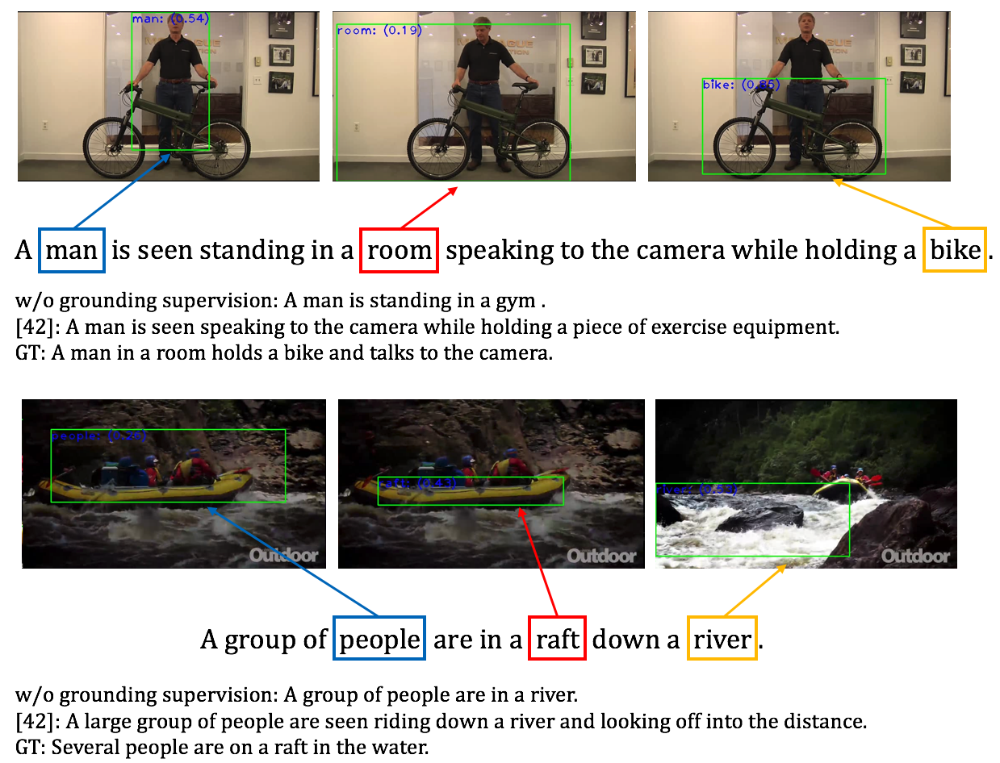

# Grounded Video Description
This repo hosts the source code for our paper [Grounded Video Description](https://arxiv.org/pdf/1812.06587.pdf). It supports [ActivityNet-Entities](https://github.com/facebookresearch/ActivityNet-Entities) dataset. We also have code that supports [Flickr30k-Entities](https://github.com/BryanPlummer/flickr30k_entities) dataset, hosted at the [flickr_branch](https://github.com/facebookresearch/grounded-video-description/tree/flickr_branch) branch.



Note: [42] indicates [Masked Transformer](https://github.com/LuoweiZhou/densecap)


## Quick Start
### Preparations
Follow the instructions 1 to 3 in the [Requirements](#req) section to install required packages.

### Download everything
Simply run the following command to download all the data and pre-trained models (total 216GB):
```
bash tools/download_all.sh
```

### Starter code
Run the following eval code to test if your environment is setup:
```
python main.py --batch_size 100 --cuda --num_workers 6 --max_epoch 50 --inference_only \
    --start_from save/anet-sup-0.05-0-0.1-run1 --id anet-sup-0.05-0-0.1-run1 \
    --seq_length 20 --language_eval --eval_obj_grounding --obj_interact
```

(Optional) Single-GPU training code for double-check:
```
python main.py --batch_size 20 --cuda --checkpoint_path save/gvd_starter --id gvd_starter --language_eval
```
You can now skip to the [Training and Validation](#train) section!


## <a name='req'></a> Requirements (Recommended)
1) Clone the repo recursively:
```
git clone --recursive git@github.com:facebookresearch/grounded-video-description.git
```
Make sure all the submodules [densevid_eval](https://github.com/LuoweiZhou/densevid_eval_spice) and [coco-caption](https://github.com/tylin/coco-caption) are included.

2) Install CUDA 9.0 and CUDNN v7.1. Later versions should be fine, but might need to get the conda env file updated (e.g., for PyTorch).

3) Install [Miniconda](https://conda.io/miniconda.html) (either Miniconda2 or 3, version 4.6+). We recommend using conda [environment](https://docs.conda.io/projects/conda/en/latest/user-guide/tasks/manage-environments.html) to install required packages, including Python 2.7, [PyTorch 1.1.0](https://pytorch.org/get-started/locally/) etc.:
```
MINICONDA_ROOT=[to your Miniconda root directory]
conda env create -f cfgs/conda_env_gvd.yml --prefix $MINICONDA_ROOT/envs/gvd_pytorch1.1
conda activate gvd_pytorch1.1
```

4) (Optional) If you choose to not use `download_all.sh`, be sure to install JAVA and download Stanford CoreNLP for SPICE (see [here](https://github.com/tylin/coco-caption)). Also, download and place the reference [file](https://github.com/jiasenlu/coco-caption/blob/master/annotations/caption_flickr30k.json) under `coco-caption/annotations`. Download [Stanford CoreNLP 3.9.1](https://stanfordnlp.github.io/CoreNLP/history.html) for grounding evaluation and place the uncompressed folder under the `tools` directory.


## Data Preparation
Download the preprocessed annotation files from [here](https://dl.fbaipublicfiles.com/ActivityNet-Entities/ActivityNet-Entities/anet_entities_prep.tar.gz), uncompress and place them under `data/anet`. Or you can reproduce them all using the data from ActivityNet-Entities [repo](https://github.com/facebookresearch/ActivityNet-Entities) and the preprocessing script `prepro_dic_anet.py` under `prepro`. Then, download the ground-truth caption annotations (under our val/test splits) from [here](https://dl.fbaipublicfiles.com/ActivityNet-Entities/ActivityNet-Entities/anet_entities_captions.tar.gz) and same place under `data/anet`.

The region features and detections are available for download ([feature](https://dl.fbaipublicfiles.com/ActivityNet-Entities/ActivityNet-Entities/fc6_feat_100rois.tar.gz) and [detection](https://dl.fbaipublicfiles.com/ActivityNet-Entities/ActivityNet-Entities/anet_detection_vg_fc6_feat_100rois.h5)). The region feature file should be decompressed and placed under your feature directory. We refer to the region feature directory as `feature_root` in the code. The H5 region detection (proposal) file is referred to as `proposal_h5` in the code.

The frame-wise appearance (with suffix `_resnet.npy`) and motion (with suffix `_bn.npy`) feature files are available [here](https://dl.fbaipublicfiles.com/ActivityNet-Entities/ActivityNet-Entities/rgb_motion_1d.tar.gz). We refer to this directory as `seg_feature_root`.

Other auxiliary files, such as the weights from Detectron fc7 layer, are available [here](https://dl.fbaipublicfiles.com/ActivityNet-Entities/ActivityNet-Entities/detectron_weights.tar.gz). Uncompress and place under the `data` directory.


## <a name='train'></a> Training and Validation
Modify the config file `cfgs/anet_res101_vg_feat_10x100prop.yml` with the correct dataset and feature paths (or through symlinks). Link `tools/anet_entities` to your ANet-Entities dataset root location. Create new directories `log` and `results` under the root directory to save log and result files.

The example command on running a 8-GPU data parallel job:

For supervised models (with self-attention):
```
CUDA_VISIBLE_DEVICES=0,1,2,3,4,5,6,7 python main.py --path_opt cfgs/anet_res101_vg_feat_10x100prop.yml \
    --batch_size $batch_size --cuda --checkpoint_path save/$ID --id $ID --mGPUs \
    --language_eval --w_att2 $w_att2 --w_grd $w_grd --w_cls $w_cls --obj_interact | tee log/$ID
```

For unsupervised models (without self-attention):
```
CUDA_VISIBLE_DEVICES=0,1,2,3,4,5,6,7 python main.py --path_opt cfgs/anet_res101_vg_feat_10x100prop.yml \
    --batch_size $batch_size --cuda --checkpoint_path save/$ID --id $ID --mGPUs \
    --language_eval | tee log/$ID
```
Arguments: `batch_size=240`, `w_att2=0.05`, `w_grd=0`, `w_cls=0.1`, `ID` indicates the model name. (Optional) Remove `--mGPUs` to run in single-GPU mode.

### Pre-trained Models
The pre-trained models can be downloaded from [here (1.5GB)](https://dl.fbaipublicfiles.com/ActivityNet-Entities/ActivityNet-Entities/pre-trained-models.tar.gz). Make sure you uncompress the file under the `save` directory (create one under the root directory if not exists).


## Inference and Testing
For supervised models (`ID=anet-sup-0.05-0-0.1-run1`):

(standard inference: language evaluation and localization evaluation on generated sentences)

```
python main.py --path_opt cfgs/anet_res101_vg_feat_10x100prop.yml --batch_size 100 --cuda \
    --num_workers 6 --max_epoch 50 --inference_only --start_from save/$ID --id $ID \
    --val_split $val_split --densecap_references $references --densecap_verbose --seq_length 20 \
    --language_eval --eval_obj_grounding --obj_interact \
    | tee log/eval-$val_split-$ID-beam$beam_size-standard-inference
```

(GT inference: localization evaluation on GT sentences)

```
python main.py --path_opt cfgs/anet_res101_vg_feat_10x100prop.yml --batch_size 100 --cuda \
    --num_workers 6 --max_epoch 50 --inference_only --start_from save/$ID --id $ID \
    --val_split $val_split --seq_length 40 --eval_obj_grounding_gt --obj_interact \
    | tee log/eval-$val_split-$ID-beam$beam_size-gt-inference
```

For unsupervised models (`ID=anet-unsup-0-0-0-run1`), simply remove the `--obj_interact` option.

Arguments: `references="./data/anet/anet_entities_val_1.json ./data/anet/anet_entities_val_2.json"`, `val_split='validation'`. If you want to evaluate on the test split, set `val_split='testing'` and `references` accordingly and submit the object localization output files under `results` to the [eval server]().

You need at least 9GB of free GPU memory for the evaluation.


## Reference
Please acknowledge the following paper if you use the code:

```
@inproceedings{zhou2019grounded,
  title={Grounded Video Description},
  author={Zhou, Luowei and Kalantidis, Yannis and Chen, Xinlei and Corso, Jason J and Rohrbach, Marcus},
  journal={CVPR},
  year={2019}
}
```


## Acknowledgement
We thank Jiasen Lu for his [Neural Baby Talk](https://github.com/jiasenlu/NeuralBabyTalk) repo. We thank Chih-Yao Ma for his helpful discussions.


## License
This project is licensed under the license found in the LICENSE file in the root directory of this source tree. 

Portions of the source code are based on the [Neural Baby Talk](https://github.com/jiasenlu/NeuralBabyTalk) project.
